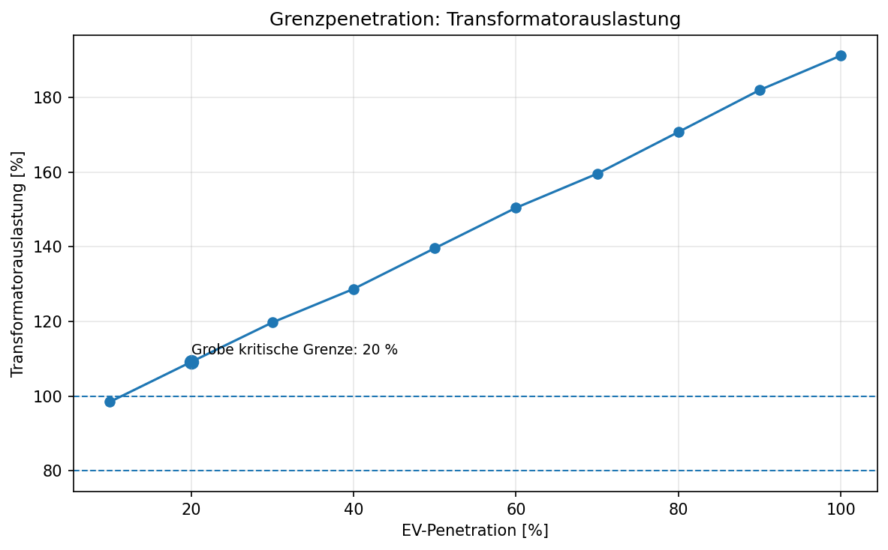
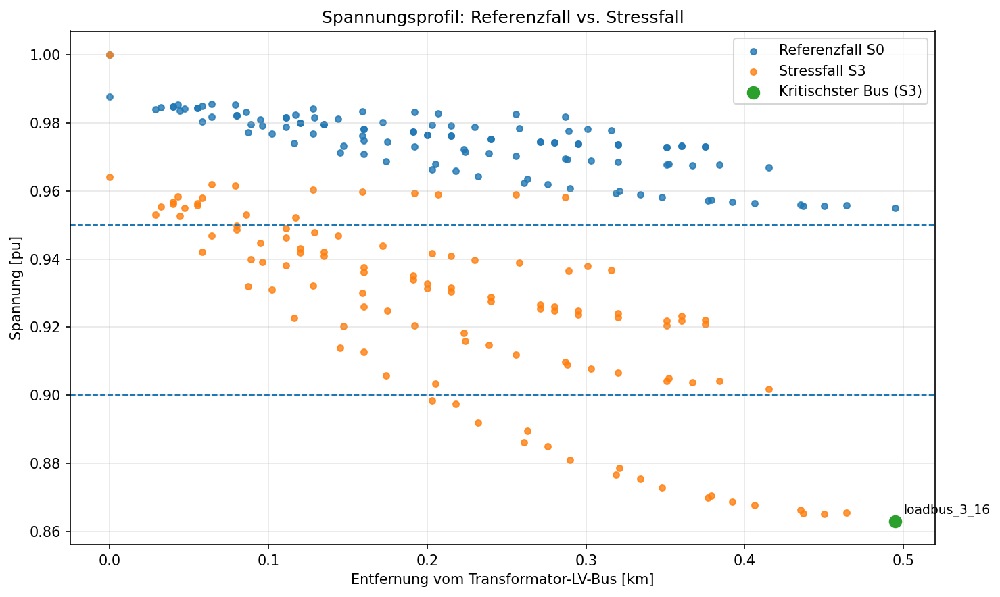
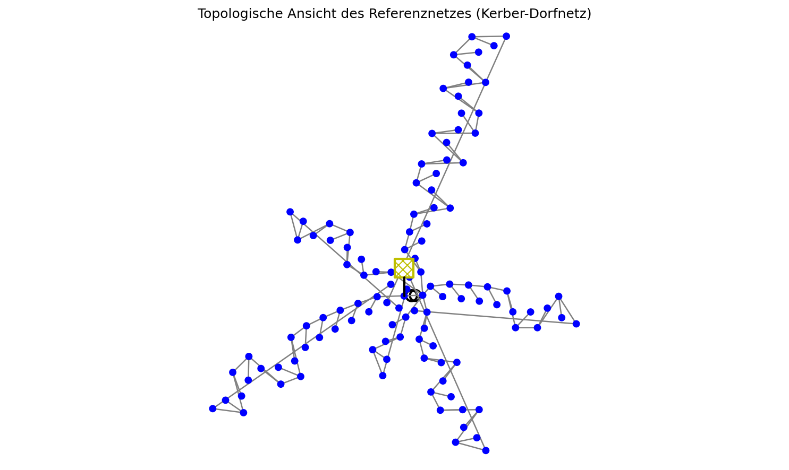

# P1_EV_Impact_Analysis


## Short English Summary

This project evaluates the impact of additional EV charging loads on a representative low-voltage distribution grid using Python and pandapower.  
The analysis focuses on transformer loading, line loading, and voltage profile under different EV penetration and simultaneity scenarios.  
In addition to the baseline scenario comparison, the project includes a simplified mitigation test based on reduced wallbox power and a hosting-capacity-style penetration assessment.  
The main result is that the transformer becomes the dominant bottleneck, while a simple power limitation improves the situation but does not fully eliminate critical conditions.  
The project is designed as a GitHub-ready engineering portfolio study with reproducible notebook outputs, exported figures, and technical interpretation.

## Zentrale Abbildungen

### Grenzpenetration in Bezug auf die Transformatorauslastung


Diese Abbildung zeigt die **grobe** Baseline-Grenzpenetrationsanalyse in **10-%-Schritten**. Die markierte kritische Grenze liegt in dieser Voranalyse bei **20 %**. Die anschließende Feinauflösung im Bereich **10 % bis 30 %** zeigt jedoch, dass die erste kritische Grenze bereits bei ca. **12 %** ohne Mitigation bzw. bei ca. **18 %** mit 7-kW-Mitigation beginnt.

### Spannungsprofil im Referenzfall und Stressfall


Diese Abbildung veranschaulicht den Spannungsabfall entlang des Niederspannungsnetzes und macht die kritischen Spannungszustände im Stressfall direkt sichtbar.

### Topologische Ansicht des Referenznetzes


Diese Abbildung zeigt eine vereinfachte topologische Darstellung des verwendeten Kerber-Dorfnetzes. Sie dient der strukturellen Einordnung des Referenzmodells und stellt keine geographische Abbildung eines realen Versorgungsgebiets dar.

## Szenarien und zentrale Kennzahlen

| Kennzahl | Ergebnis |
|---|---:|
| Transformatorauslastung im Stressfall (S3) | 231.2 % |
| Maximale Leitungsauslastung im Stressfall (S3) | 153.6 % |
| Minimale Knotenspannung im Stressfall (S3) | 0.8631 pu |
| Trafo-Auslastung S3 → S3-M (7 kW) | 231.2 % → 176.8 % |
| Erste kritische EV-Penetration ohne Mitigation | ca. 12 % |
| Erste kritische EV-Penetration mit 7-kW-Mitigation | ca. 18 % |

Diese kompakten Kennzahlen zeigen auf einen Blick, dass der Transformator im betrachteten Netz die maßgebende Restriktion darstellt. Gleichzeitig wird sichtbar, dass die vereinfachte Mitigation die technische Aufnahmegrenze verbessert, den kritischen Bereich jedoch nicht vollständig aufhebt.

## Projektziel

Ziel dieses Projekts ist die technische Bewertung der Auswirkungen zusätzlicher E-Fahrzeug-Ladeleistungen auf ein typisches Niederspannungsnetz. Untersucht wird, wie sich unterschiedliche EV-Szenarien in Abhängigkeit von Penetration und Gleichzeitigkeitsfaktor auf Transformatorauslastung, Leitungsauslastung und Knotenspannungen auswirken.

Das Projekt ist als GitHub-fähige technische Portfoliostudie aufgebaut. Im Mittelpunkt stehen nicht nur die Lastflussberechnung und die tabellarische Ergebnisdarstellung, sondern auch die technische Einordnung der Resultate, ein vereinfachter Mitigationstest sowie ein Grenzpenetrationsansatz zur Abschätzung der technischen Aufnahmegrenze.

## Technische Fragestellung

Die zentrale Fragestellung lautet:

**Wie stark belasten zusätzliche EV-Ladeleistungen ein typisches Niederspannungsnetz, wie wirksam ist eine einfache netzorientierte Leistungsbegrenzung im Stressfall, und ab welcher EV-Penetration treten erste kritische technische Zustände auf?**

Daraus ergeben sich insbesondere folgende Teilfragen:

- Wie verändern sich Transformatorauslastung, maximale Leitungsauslastung und minimale Knotenspannung zwischen Referenzfall und EV-Szenarien?
- Welche Betriebsmittel werden im Stressfall maßgebend?
- Wie stark reduziert eine vereinfachte Reduktion der Wallbox-Leistung die technische Belastung?
- Wie verschiebt sich die erste kritische EV-Penetration durch die Mitigation?

## Netzmodell und Annahmen

Als Netzmodell wird ein repräsentatives Niederspannungsnetz aus `pandapower` verwendet (`create_kerber_dorfnetz()`). Es handelt sich nicht um ein reales Versorgungsgebiet, sondern um ein typisches Testnetz für eine nachvollziehbare und reproduzierbare Portfolioanalyse.

**Wichtige Einordnung:** Da es sich um ein repräsentatives Testnetz und nicht um ein real kalibriertes Netz eines konkreten Netzbetreibers handelt, sind in diesem Projekt vor allem die **relativen Veränderungen** zwischen Referenzfall, EV-Szenarien, Mitigation und Grenzpenetration aussagekräftig. Insbesondere ein bereits im Referenzfall vergleichsweise hohes Ausgangsniveau einzelner Kennwerte – etwa der Transformatorauslastung – ist daher nicht als standortspezifische Realnetzaussage zu verstehen, sondern als Eigenschaft des verwendeten Referenznetzes.

Wesentliche Annahmen des Projekts:

- EV-Ladepunkte werden an ausgewählten Lastknoten des Netzes ergänzt.
- Die Szenarien unterscheiden sich hinsichtlich EV-Penetration und Gleichzeitigkeitsfaktor.
- Für die Hauptanalyse wird mit einer Wallbox-Leistung von 11 kW gearbeitet.
- Der vereinfachte Mitigationstest reduziert im Stressfall die Wallbox-Leistung auf 7 kW.
- Die Grenzpenetration wird schrittweise unter konstanten Annahmen abgeschätzt.
- Die Bewertung erfolgt auf Basis praktischer Schwellen für Spannung, Leitungsauslastung und Transformatorauslastung; es handelt sich nicht um einen formalen Netznachweis.
- EV-Lasten wurden in dieser Portfolioanalyse als rein wirkleistungsseitige Zusatzlasten modelliert (`q_mvar = 0`). Ein möglicher Blindleistungsanteil realer Ladeeinrichtungen wird damit nicht abgebildet.

## Szenarien

Untersucht werden vier Hauptszenarien:

- **S0 — Referenzfall:** Ausgangszustand ohne zusätzliche EV-Ladeleistungen
- **S1 — Moderate EV-Integration:** erste zusätzliche EV-Lasten bei moderater Penetration
- **S2 — Erhöhte EV-Integration:** höhere EV-Durchdringung bei erhöhter Netzbelastung
- **S3 — Stressfall:** hohe EV-Penetration mit ungünstiger Gleichzeitigkeitsannahme

Ergänzend werden zwei weitere Analysebausteine betrachtet:

- **S3_Mitigation:** Stressfall mit reduzierter Wallbox-Leistung von 7 kW
- **Grenzpenetrationsanalyse:** schrittweise Erhöhung der EV-Penetration zur Abschätzung der ersten kritischen Grenze, jeweils ohne und mit Mitigation

## Bewertungslogik

Zur technischen Einordnung der Ergebnisse wird eine vereinfachte, praxisnahe Bewertungslogik verwendet:

- **Minimale Knotenspannung < 0,95 pu:** auffällig / erhöhte Aufmerksamkeit
- **Minimale Knotenspannung < 0,90 pu:** kritisch
- **Maximale Leitungsauslastung > 80 %:** auffällig
- **Maximale Leitungsauslastung > 100 %:** kritisch
- **Transformatorauslastung > 100 %:** kritisch

Diese Schwellen dienen der technischen Interpretation im Kontext eines Portfolio-Projekts. Die Ergebnisse stellen keinen formalen Netznachweis und keine verbindliche Netzanschlussbewertung dar.

In der Praxis erfolgt die Netzanschlussbewertung im Niederspannungsbereich unter anderem im Kontext der VDE-AR-N 4100. Die hier verwendete Bewertungslogik orientiert sich an praxisnahen Richtwerten und dient der technischen Einordnung im Rahmen eines Portfolio-Projekts; sie ersetzt keinen formalen Netznachweis nach projektspezifischen Betreiberregeln.

## Zentrale Ergebnisse der Szenarioanalyse

Die Szenarioanalyse zeigt eine klare Zunahme der Netzbeanspruchung mit steigender EV-Integration. Besonders deutlich wird dies bei der Transformatorauslastung und bei der minimalen Knotenspannung im Stressfall.

Wesentliche Beobachtungen:

- Der Transformator stellt im betrachteten Netz den dominanten Engpass dar.
- Mit zunehmender EV-Penetration sinken die Knotenspannungen sichtbar ab.
- Im Stressfall treten deutliche technische Auffälligkeiten auf, insbesondere bei der Kombination aus hoher EV-Last und ungünstigem Gleichzeitigkeitsfaktor.
- Die Leitungsauslastung steigt ebenfalls an, bleibt jedoch im Projektkontext gegenüber dem Transformator als sekundärer Engpass einzuordnen.
- Die Ergebnisse zeigen, dass nicht nur der Lastzuwachs selbst, sondern auch die Gleichzeitigkeitsannahme einen starken Einfluss auf die Netzbewertung hat.

## Vereinfachter Mitigationstest

Zusätzlich zur Szenarioanalyse wurde ein vereinfachter Mitigationstest durchgeführt. Ausgangspunkt ist der Stressfall **S3**, in dem hohe EV-Penetration und ungünstige Gleichzeitigkeitsannahmen zu einer deutlich erhöhten Netzbeanspruchung führen.

Für den Mitigationstest wurden EV-Anzahl, Platzierung und Gleichzeitigkeitsfaktor beibehalten, jedoch die Wallbox-Leistung von **11 kW auf 7 kW** reduziert. Damit lässt sich untersuchen, inwieweit eine einfache netzorientierte Leistungsbegrenzung die technische Belastung im Niederspannungsnetz verringert.

Ergebnis:

- Die Mitigation reduziert die technische Belastung im Stressfall sichtbar.
- Transformatorauslastung, Leitungsauslastung und Spannungsniveau verbessern sich gegenüber dem ursprünglichen Stressfall.
- Die Maßnahme reicht jedoch nicht aus, um einen stark belasteten Stressfall vollständig in einen unkritischen Bereich zurückzuführen.

Damit zeigt das Projekt nicht nur das Problem, sondern auch die Wirkung einer einfachen, technisch plausiblen Gegenmaßnahme.

## Grenzpenetration / Hosting-Capacity-Ansatz

Über die reine Szenarioanalyse hinaus wird ein vereinfachter Grenzpenetrationsansatz verwendet. Ziel ist die Abschätzung, ab welcher EV-Penetration im betrachteten Netz erstmals ein kritischer technischer Zustand auftritt.

Für die Baseline-Analyse wurden konstante Annahmen verwendet:

- verteilte EV-Platzierung (`distributed`)
- Gleichzeitigkeitsfaktor **GF = 0,60**
- Wallbox-Leistung **11 kW**

Die feinaufgelöste Untersuchung im Bereich zwischen **10 % und 30 % EV-Penetration** zeigt:

- **ohne Mitigation** beginnt die erste kritische Grenze bei etwa **12 %**
- **mit 7 kW-Mitigation** verschiebt sich diese Grenze auf etwa **18 %**

Damit wird deutlich, dass die vereinfachte Mitigation nicht nur die Belastung im Stressfall reduziert, sondern auch die technische Aufnahmegrenze des betrachteten Netzes erhöht.

## Visualisierungen

Die wichtigsten Ergebnisse werden durch exportierte Abbildungen und Tabellen dokumentiert. Dazu gehören insbesondere:

- Transformatorauslastung über die EV-Szenarien
- minimale Knotenspannung über die EV-Szenarien
- Leitungsauslastung der maßgebenden Leitungen im Vergleich Referenzfall vs. Stressfall
- Spannungsprofil im Referenzfall und Stressfall
- Grenzpenetration in Bezug auf die Transformatorauslastung

Die Ergebnisse sind im Projekt unter `results/figures/` und `results/tables/` abgelegt und können direkt für Dokumentation, GitHub-Präsentation und spätere CV-Bezüge verwendet werden.

## Technische Grenzen der Analyse

Das Projekt ist bewusst als technisch fundierte, aber vereinfachte Portfolioanalyse aufgebaut. Daraus ergeben sich folgende Grenzen:

- Es wird ein repräsentatives Testnetz und kein reales Versorgungsgebiet verwendet.
- Die Analyse basiert auf stationären Lastflussrechnungen und nicht auf Zeitreihen.
- Es erfolgt keine wirtschaftliche Bewertung möglicher Maßnahmen.
- Es wird keine formale Netzanschlussprüfung nach projektspezifischen Betreiberregeln durchgeführt.
- Die Bewertungslogik basiert auf praxisnahen Schwellen zur technischen Einordnung, ersetzt jedoch keinen vollständigen Netznachweis.

Gerade durch diese bewusste Abgrenzung bleibt das Projekt fachlich nachvollziehbar, reproduzierbar und als Portfolioarbeit realistisch umsetzbar.

## Projektstruktur

```markdown
P1_EV_Impact_Analysis/
├── README.md
├── requirements.txt
├── notebooks/
│   └── P1_EV_Impact_Analysis.ipynb
└── results/
    ├── figures/
    ├── tables/
    └── reports/
```
Die wesentlichen Ergebnisdateien werden systematisch in den Ordnern results/figures/ und results/tables/ abgelegt. Dadurch bleibt die Analyse nachvollziehbar und für GitHub sowie spätere Bewerbungsunterlagen sauber nutzbar.

## Reproduzierbarkeit

Für die Reproduzierbarkeit des Projekts werden Python, Jupyter Notebook und die Bibliothek pandapower verwendet. Die Berechnung basiert auf einem deterministischen, szenariobasierten Vorgehen ohne externe Echtzeitdatenquellen.

**Hinweis:** Die topologische Netzvisualisierung ist ein optionaler Darstellungsbaustein. Je nach Umgebung können dafür zusätzliche Visualisierungsabhängigkeiten wie `graphviz` und `pygraphviz` erforderlich sein. Die eigentliche Lastflussanalyse und die zentralen Projektergebnisse sind davon jedoch nicht abhängig.

Empfohlene Schritte zur Reproduktion:

1. Repository lokal klonen
2. Abhängigkeiten aus `requirements.txt` installieren
3. Das Notebook `notebooks/P1_EV_Impact_Analysis.ipynb` öffnen
4. Alle Zellen in Reihenfolge ausführen
5. Exportierte Tabellen und Abbildungen in `results/` prüfen

Die Analyse ist so aufgebaut, dass zentrale Tabellen und Abbildungen direkt aus dem Notebook heraus exportiert werden können.

## Fazit

Das Projekt zeigt, dass zusätzliche EV-Ladeleistungen bereits in einem vereinfachten Niederspannungsnetz zu klar erkennbaren betrieblichen Spannungen führen können. Mit steigender EV-Penetration nehmen insbesondere die Transformatorauslastung und die Spannungsprobleme deutlich zu.

Gleichzeitig wird sichtbar, dass eine einfache netzorientierte Leistungsbegrenzung die Situation zwar nicht vollständig löst, aber technisch relevante Verbesserungen bewirken kann. Besonders wichtig ist dabei, dass sich auch die geschätzte kritische Aufnahmegrenze des Netzes durch die Mitigation nach oben verschiebt.

Damit liefert das Projekt nicht nur eine reine Szenarioanalyse, sondern eine kompakte technische Argumentation aus Belastungsbewertung, vereinfachter Gegenmaßnahme und Grenzabschätzung.

## Mögliche nächste Schritte

Mögliche fachliche Erweiterungen des Projekts wären:

zeitabhängige Lastprofile statt rein stationärer Szenarien
weiterführende Analyse der maßgebenden Leitungen und Knoten
kombinierte Betrachtung von EV- und PV-Einspeisung
vereinfachte trafoorientierte Regelstrategie als weiterführender Mitigation-Ansatz
Übertragung des methodischen Rahmens auf weitere Netzmodelle

Im aktuellen Stand ist das Projekt jedoch bewusst auf eine erste, technisch belastbare und GitHub-taugliche Portfoliofassung begrenzt.